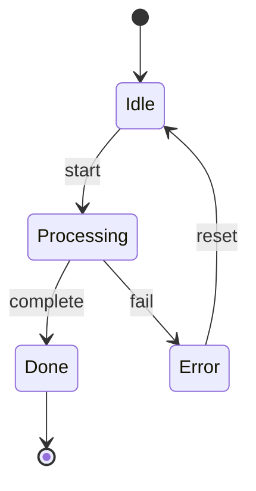

# fix: circular node intersection alignment for state diagrams

Fix edge attachment alignment for circular node shapes (SmallCircle, FramedCircle, CrossedCircle) and improve rendering accuracy in state diagrams.

## Changes
- `intersect_circle()` — circular shape intersection with cardinal-direction preference
- `is_circular_shape()` — helper to eliminate code duplication  
- `midpoint_attachment_point()` — face-midpoint attachment for circular terminals
- `spread_points_on_face()` — use `.div_ceil(2)` for cleaner rounding
- Updated `calculate_attachment_points()` to use face-midpoint logic
- 3 new tests + 2 snapshot updates

## Testing
- ✅ 43/43 intersect module tests pass
- ✅ 7/7 state compliance tests pass
- ✅ All 3048 tests pass
- ✅ No clippy warnings

## Impact
- Circular node edges attach at face midpoints (better centering)
- Cross-direction override edges reduce delta drift (≤1 cell)
- State diagram terminal nodes [*] render with improved alignment

## Example

