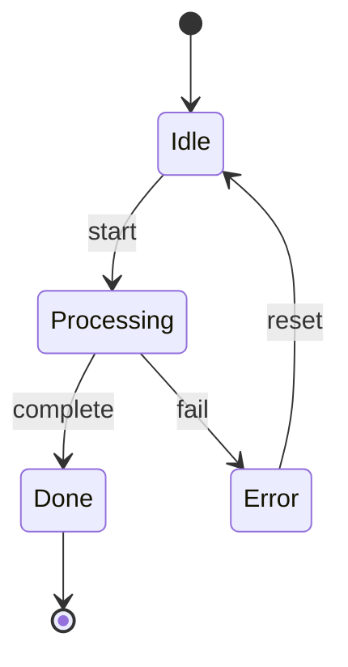

# State Diagram Test

```mermaid
stateDiagram-v2
    [*] --> Idle
    Idle --> Processing : start
    Processing --> Done : complete
    Processing --> Error : fail
    Error --> Idle : reset
    Done --> [*]
```

This file reproduces the state diagram case used during rendering tests.
